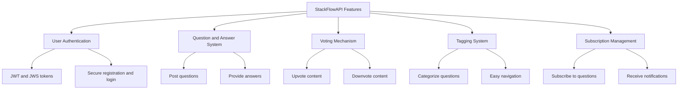
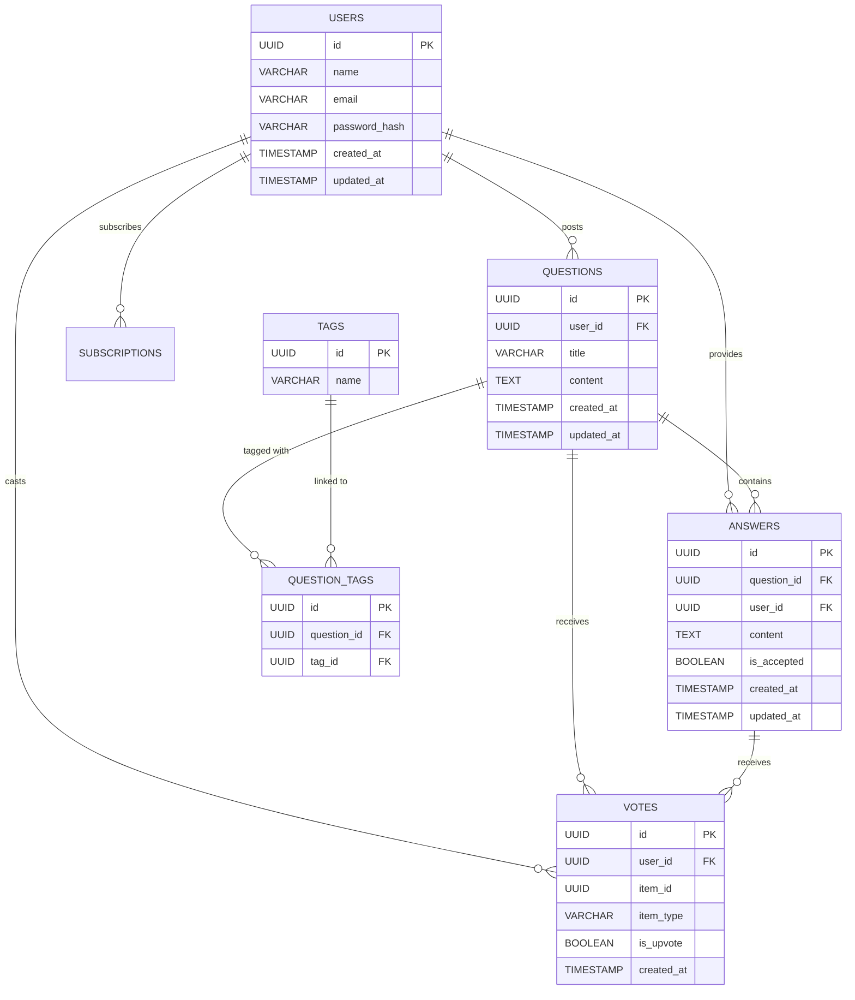
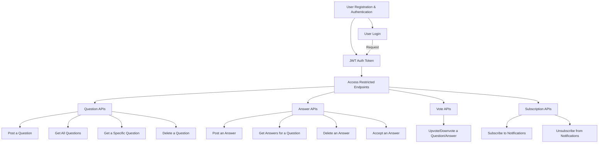

<div align="center">
  <h1>🚀 StackFlowAPI Project</h1>
  <p>
    <a href="https://github.com/ThePsyberSleuth"></a>
    <a href="https://linkedin.com/in/fitzgerald-bowier"></a>
    <a href="https://krypt0.dev"></a>
  </p>
  <p><em>A powerful Q&A platform API with user authentication, voting, and subscription features.</em></p>
</div>

# Overview

Welcome to the StackFlowAPI Project! This repository contains the database schema and API design for a robust Q&A
platform that enables users to post questions, provide answers, vote on content, and manage subscriptions for
notifications.

# Table of contents

- [Features](#features)
- [Database Schema](#database-schema)
- [SQL Schema](#sql-schema)
- [API Design](#api-design)
- [Getting Started](#getting-started)
- [Contributing](#contributing)
- [License](#license)

## Features

<details>
<summary>⬇️ Explore StackFlowAPI's Key Features ⬇️</summary>



</details>

## Database Schema

Our database schema is designed to efficiently support all features of the StackFlowAPI.

<details>
<summary>⬇️ Explore the Database Structure ⬇️</summary>



</details>

## SQL Schema

<details>
<summary>⬇️ View Detailed SQL Schema ⬇️</summary>

Here are the SQL statements to create the database tables:

1. Users Table

```sql
CREATE EXTENSION IF NOT EXISTS "uuid-ossp";

CREATE TABLE users (
    id UUID PRIMARY KEY DEFAULT uuid_generate_v4(),
    name VARCHAR(255) NOT NULL,
    email VARCHAR(255) UNIQUE NOT NULL,
    password_hash VARCHAR(255) NOT NULL,
    created_at TIMESTAMP DEFAULT CURRENT_TIMESTAMP,
    updated_at TIMESTAMP DEFAULT CURRENT_TIMESTAMP
);
```

2. Questions Table

```sql
CREATE TABLE questions (
    id UUID PRIMARY KEY DEFAULT uuid_generate_v4(),
    user_id UUID NOT NULL,
    title VARCHAR(255) NOT NULL,
    content TEXT NOT NULL,
    created_at TIMESTAMP DEFAULT CURRENT_TIMESTAMP,
    updated_at TIMESTAMP DEFAULT CURRENT_TIMESTAMP,
    FOREIGN KEY (user_id) REFERENCES users(id) ON DELETE CASCADE
);
```

3. Answers Table

```sql
CREATE TABLE answers (
    id UUID PRIMARY KEY DEFAULT uuid_generate_v4(),
    question_id UUID NOT NULL,
    user_id UUID NOT NULL,
    content TEXT NOT NULL,
    is_accepted BOOLEAN DEFAULT FALSE,
    created_at TIMESTAMP DEFAULT CURRENT_TIMESTAMP,
    updated_at TIMESTAMP DEFAULT CURRENT_TIMESTAMP,
    FOREIGN KEY (question_id) REFERENCES questions(id) ON DELETE CASCADE,
    FOREIGN KEY (user_id) REFERENCES users(id) ON DELETE CASCADE
);
```

4. Votes Table

```sql
CREATE TABLE votes (
    id UUID PRIMARY KEY DEFAULT uuid_generate_v4(),
    user_id UUID NOT NULL,
    item_id UUID NOT NULL,
    item_type VARCHAR(20) CHECK (item_type IN ('question', 'answer')) NOT NULL,
    is_upvote BOOLEAN NOT NULL,
    created_at TIMESTAMP DEFAULT CURRENT_TIMESTAMP,
    FOREIGN KEY (user_id) REFERENCES users(id) ON DELETE CASCADE
);
```

5. Tags Table

```sql
CREATE TABLE tags (
    id UUID PRIMARY KEY DEFAULT uuid_generate_v4(),
    name VARCHAR(50) UNIQUE NOT NULL
);
```

6. Question_Tags Table

```sql
CREATE TABLE question_tags (
    id UUID PRIMARY KEY DEFAULT uuid_generate_v4(),
    question_id UUID NOT NULL,
    tag_id UUID NOT NULL,
    FOREIGN KEY (question_id) REFERENCES questions(id) ON DELETE CASCADE,
    FOREIGN KEY (tag_id) REFERENCES tags(id) ON DELETE CASCADE
);
```

7. Subscriptions Table

```sql
CREATE TABLE subscriptions (
    id UUID PRIMARY KEY DEFAULT uuid_generate_v4(),
    user_id UUID NOT NULL,
    question_id UUID NOT NULL,
    subscribed BOOLEAN DEFAULT TRUE,
    created_at TIMESTAMP DEFAULT CURRENT_TIMESTAMP,
    FOREIGN KEY (user_id) REFERENCES users(id) ON DELETE CASCADE,
    FOREIGN KEY (question_id) REFERENCES questions(id) ON DELETE CASCADE
);
```

</details>

## API Design

The StackFlowAPI uses JWT for authentication and JWS for signing tokens.

<details>
<summary>⬇️ Explore the API Structure ⬇️</summary>



### API Endpoints

1. User Authentication APIs
    - `POST /api/users/register`
    - `POST /api/users/login`

2. Question APIs
    - `POST /api/questions`
    - `GET /api/questions`
    - `GET /api/questions/{id}`
    - `DELETE /api/questions/{id}`

3. Answer APIs
    - `POST /api/questions/{questionId}/answers`
    - `GET /api/questions/{questionId}/answers`
    - `DELETE /api/questions/{questionId}/answers/{answerId}`
    - `PUT /api/questions/{questionId}/answers/{answerId}/accept`

4. Voting APIs
    - `POST /api/votes`

5. Subscription APIs
    - `POST /api/questions/{questionId}/subscribe`
    - `DELETE /api/questions/{questionId}/subscribe`

</details>

## Getting Started

(Will be updated soon)

## Contributing

We welcome contributions to the StackFlowAPI project! Please read our contributing guidelines before submitting pull
requests.

## License

This project is licensed under the MIT License - see the [LICENSE](LICENSE) file for details.

